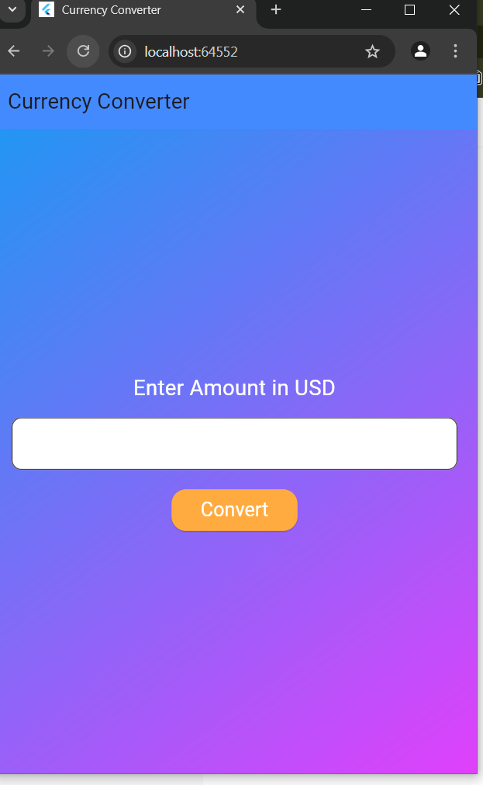
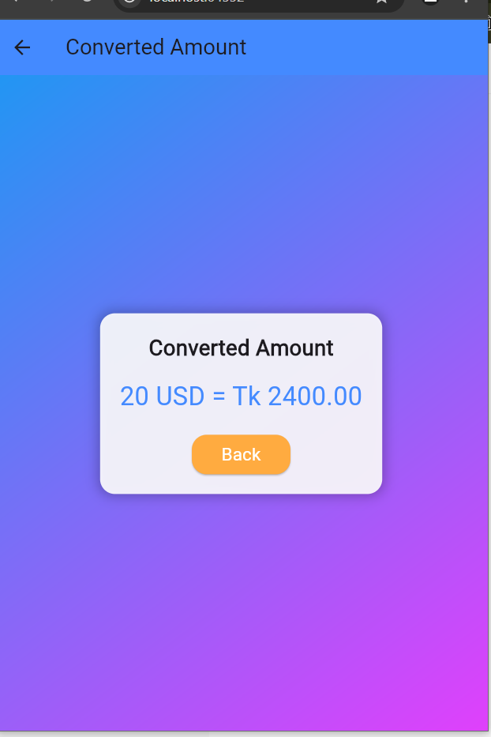

# 💱 Flutter Currency Converter (USD to BDT)

A simple and modern **Flutter Currency Converter App** that converts USD to BDT with an attractive UI.  

## 📸 Screenshots

|  |  | 
|---|---|
---

## ✨ Features  

✔️ Beautiful **gradient UI**  
✔️ **Instant USD to BDT conversion** (1 USD = 120 BDT)  
✔️ **User-friendly input field**  
✔️ **Navigation between screens**  
✔️ **Rounded buttons & smooth UI**  

---

## 🛠️ Installation & Setup  

1️⃣ Clone this repository  
```sh
git clone https://github.com/trsiddique/flutter-currency-converter.git
